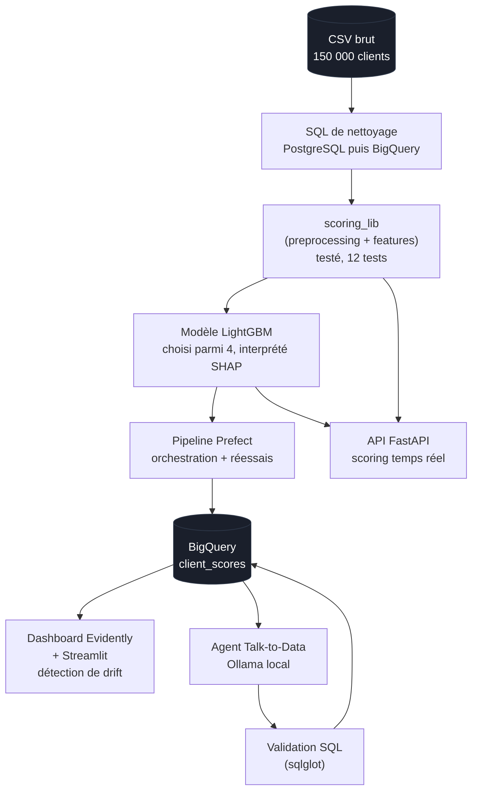

# Architecture du projet

## Vue d'ensemble

## Deux chemins de données, une seule logique

Le nettoyage et le feature engineering (`scoring_lib`) sont écrits une seule
fois et réutilisés dans deux contextes différents :

- **Batch** (pipeline Prefect) — traite les 150 000 clients d'un coup,
  automatiquement, une fois par jour
- **Temps réel** (API FastAPI) — traite un seul client, à la demande,
  en quelques centièmes de seconde

Cette réutilisation garantit que les deux chemins produisent des résultats
identiques pour un même client — un point vérifié explicitement lors de
la Semaine 6 (bug corrigé : les colonnes originales n'étaient pas
supprimées après nettoyage, faisant planter le modèle en mode temps réel).

## Sécurité de l'agent Talk-to-Data

Le LLM ne voit jamais les données, seulement la description du schéma. Le
SQL qu'il génère passe systématiquement par une validation (`sqlglot`,
voir [`agent/README.md`](../agent/README.md)) avant tout accès à BigQuery :
seules les requêtes `SELECT` sur la table `client_scores` sont autorisées.